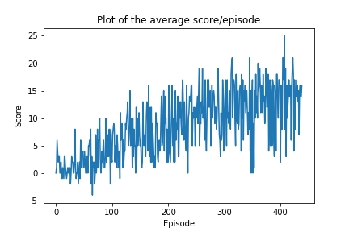

# Report

## Learning Algorithm

We used a model inspired from [Deep Q-learning](https://storage.googleapis.com/deepmind-media/dqn/DQNNaturePaper.pdf).  
The approach is a Q-learning method which is a temporal difference reinforcement learning technique that learns the values of a function Q(s, a), the quality of a couple state s and action a.  
Since the state space is continuous, a neural network is used as an approximator for the Q function.   
Still, it's not enough for the model to learn to solve this Reinforcement Learning problem due to the fact that updating the Q-network every step (since it's a temporal difference) method affects the policy and by consequence the data distribution which creates a correlation between the sequence of states and can lead to the divergence of the values of the Q-Network.  
To solve this problem Experience Replay is used, it randomly samples previously stored transitions from a buffer and thereby smooths the training distribution over many past behaviors.  
There is another problem that can hurt the training which is the moving target since the same weights to be updated are used to guess the target.  
This problem is solved using Fixed Q-targets that is achieved by creating an additional target network to predict the target values that will have the weights of the online network every fixed number of steps.  
We trained our model for 1000 episodes.
We sampled 1000 timesteps per episode and chose [0.5, 0.01] as a range for epsilon, epsilon-greedy's action selection with a decay of 0.99.


### DQN Hyperparameters
- BUFFER_SIZE = 100000, replay buffer size
- BATCH_SIZE = 64, minibatch size
- GAMMA = 0.99, discount factor
- TAU = 0.001, for soft update of target parameters
- LR = 0.0005, learning rate 
- UPDATE_EVERY = 4, how often to update the network


### Neural Network
The neural network defined in model.py has 3 fully connected layers.
The dimension of the first is state_size * 128, the second is 128 * 128 using Relu activation function for both and the third 128 * action_size.


## Plot of rewards



```
Episode 100	Average Score: 2.22
Episode 200	Average Score: 6.45
Episode 300	Average Score: 10.30
Episode 400	Average Score: 12.57
Episode 439	Average Score: 13.01
Environment solved in 439 episodes!	
Average Score: 13.01

```

## Ideas for Future Work
We can improve this algorithm using Prioritized Experience Replay, Dueling Q-Network or Double DQN.


